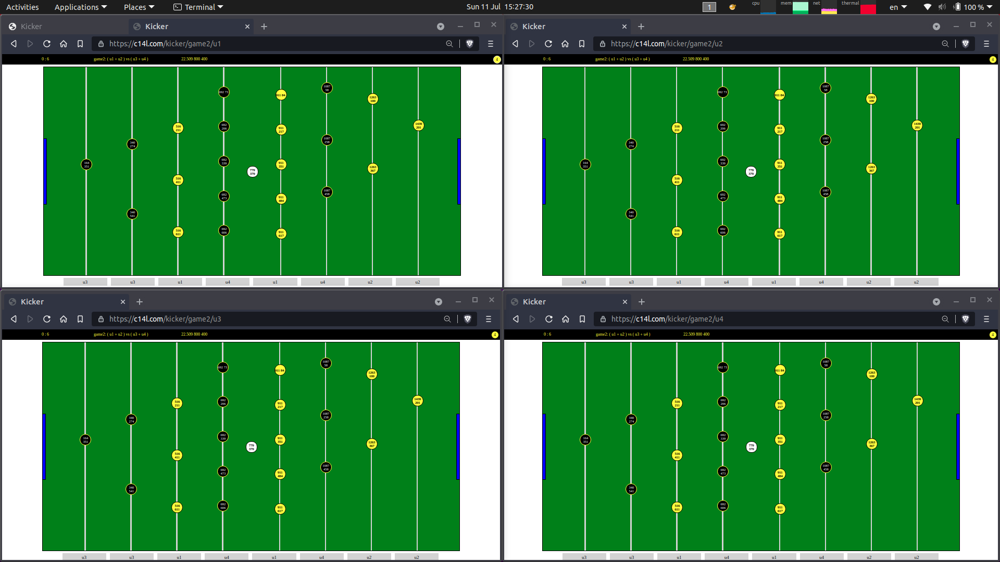

# Kicker

-- Work in Progress --

Playable, but still pretty rough around the edges.

## Basics

- Every game is played by 4 users.
- Each user controls two bars ("up" "kick" "down"):
    - left bar W-S-X,
    - right bar O-K-M
- Ball, bar offsets, goals, etc. are sync'ed via websocket.

## TODO

- Count goals

- Add key "h" or "?" for help overlay

- Fix "g" key for game reset: Make it work always. Can only be used by Server user.

- Fix "p" key for pause/resume: Can only be used by Server user.

- Improve user connect and reset:
    - At the start, overlay message how many users are connected.
    - More explicit who is Server.
    - More explicit how to pause and unpause.
    - Let users select the bars they want to play on from the remaining free bars.

- Handle disconnects
    - When a user disconnects, do not change the other user's bars or teams.
    - Keep empty place free to be occupied by the next user who connects to the game.
    - On disconnect, auto-pause game, with option to continue with only three users.

- Improve ball physics speed and drag
